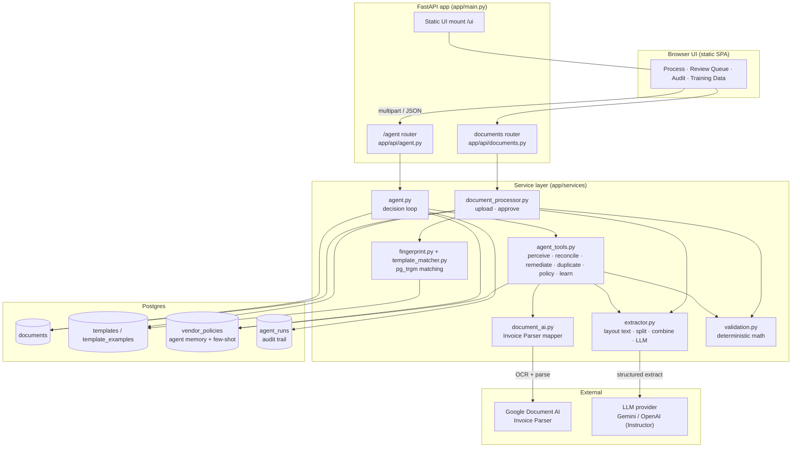
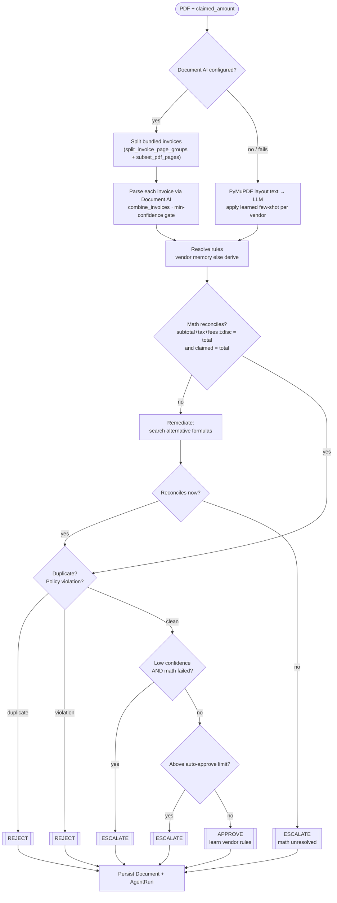
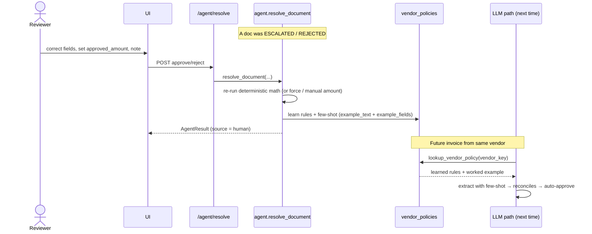

# InvoiceOps AI — Architecture

InvoiceOps AI turns invoice/receipt PDFs into **verified reimbursement decisions**.
It ships two pipelines over one Postgres database and one validation core:

1. **Autonomous agent** (`/agent/*`) — perceive → reconcile → remediate → decide → act, with a human-in-the-loop review queue and a learning loop.
2. **Manual template pipeline** (`/upload`, `/review`, `/approve`) — the original fingerprint + template flow, kept intact.

---

## System overview

---

## Agent decision loop (`/agent/process`)

---

## Human-in-the-loop learning

---

## Key building blocks

| Concern | Module | Notes |
| --- | --- | --- |
| Perception | `services/agent_tools.py`, `services/document_ai.py`, `services/extractor.py` | Document AI first (splits bundles), LLM fallback with learned few-shot |
| Verification | `services/validation.py` | Deterministic math is the confidence engine |
| Self-correction | `services/agent_tools.remediate` | Searches plausible total formulas |
| Memory / learning | `db/models.VendorPolicy` | Per-vendor rules + few-shot, keyed on GSTIN/PAN/domain |
| Audit | `db/models.AgentRun` | Every decision + full step trace |
| Template pipeline | `services/document_processor.py`, `fingerprint.py`, `template_matcher.py` | Original `pg_trgm` flow, unchanged |

**Stack:** Python 3.11 · FastAPI · SQLAlchemy 2.0 / Pydantic v2 · Postgres (`pg_trgm`) · PyMuPDF · Instructor + Gemini/OpenAI · optional Google Document AI · Docker Compose.
